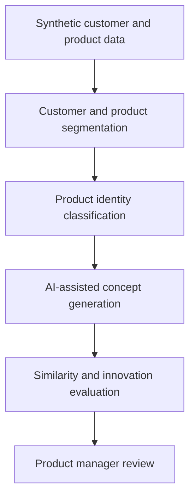
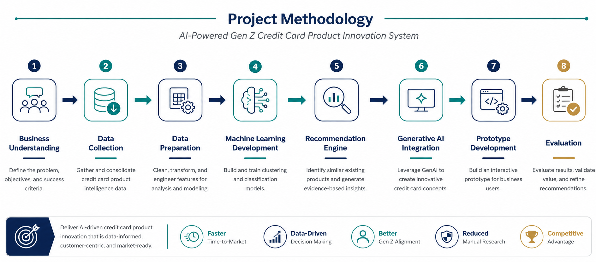
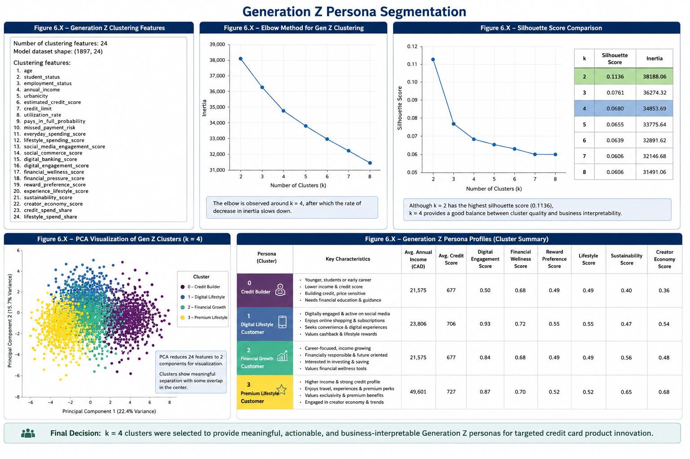
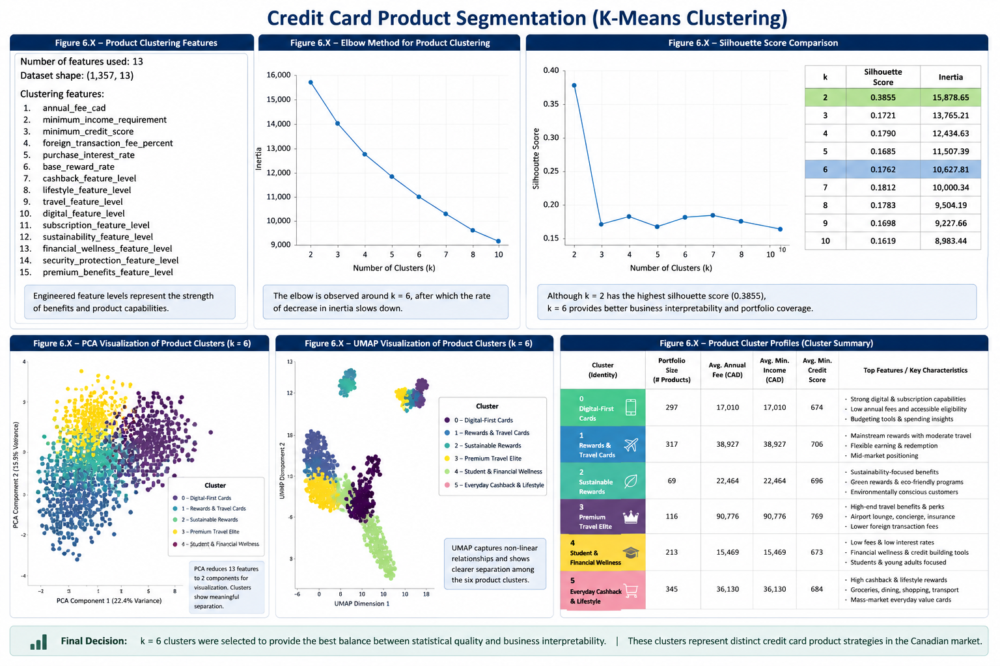
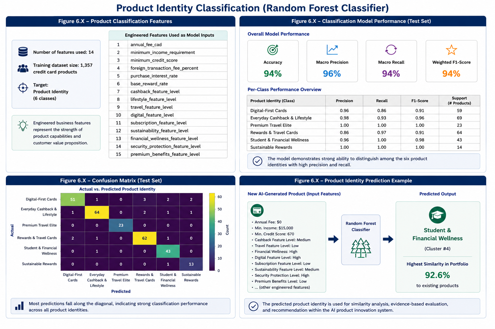
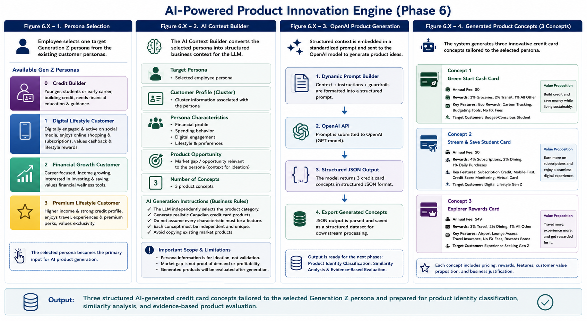
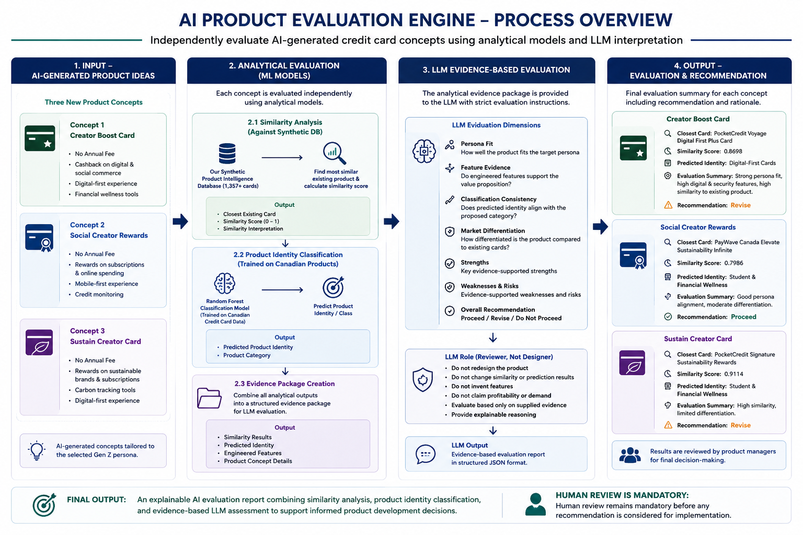

# AI-Powered Gen Z Credit Card Product Innovation System

A responsible AI proof of concept that helps Canadian bank product teams explore Gen Z customer needs and generate evidence-informed credit card concepts. The solution combines synthetic customer segmentation, product intelligence, machine-learning classification, similarity analysis, AI-assisted ideation, and human-centred evaluation.

> **Portfolio and educational project:** The system uses synthetic data and is designed for decision support and concept exploration. It must not be used to make real customer eligibility, credit, or lending decisions.

## Project overview

The system brings customer and product evidence into a single innovation workflow:





## What the proof of concept demonstrates

- Analysis of **3,000 synthetic Gen Z customer records** and **1,357 synthetic credit card products**.
- Four evidence-informed customer personas:
  - Affluent Lifestyle Explorers
  - Digital Creators
  - Financially Responsible Young Professionals
  - Budget-Conscious Students
- Product and customer segmentation using K-means clustering.
- Product-identity prediction using a Random Forest classifier.
- AI-assisted product concept generation grounded in persona and market evidence.
- Similarity and innovation evaluation to help reviewers compare a generated concept with existing product patterns.
- A Streamlit interface connected to a FastAPI backend.

The product-identity classifier achieved **94.49% held-out accuracy** during experimentation. This result reflects the project's synthetic dataset and should not be interpreted as a production benchmark or evidence of performance on real customer data.

## Solution components

| Component | Purpose |
|---|---|
| Customer segmentation | Identifies behavioural patterns and four Gen Z personas |
| Product segmentation | Groups card products by pricing, rewards, digital features, and benefits |
| Product classifier | Predicts a proposed card's product identity from structured features |
| AI concept generator | Produces persona-aligned concepts using supporting evidence |
| Evaluation engine | Reviews differentiation, similarity, value, risks, and strategic fit |
| Streamlit dashboard | Gives product teams an interactive workflow |
| FastAPI service | Exposes classification, generation, and evaluation endpoints |

## Selected project visuals

### Gen Z customer segmentation



### Product intelligence and classification





### Innovation and evaluation engines





## Technology stack

- Python, pandas, NumPy, SciPy
- scikit-learn and joblib
- FastAPI and Pydantic
- Streamlit
- OpenAI API
- Jupyter notebooks

## Run locally

### Prerequisites

- Python 3.11 or newer
- An OpenAI API key for concept generation and AI-assisted evaluation

### Setup

```bash
git clone https://github.com/SaraEdress/genz-credit-card-product-innovation.git
cd genz-credit-card-product-innovation

python -m venv .venv
```

Activate the environment:

```bash
# Windows PowerShell
.venv\Scripts\Activate.ps1

# macOS or Linux
source .venv/bin/activate
```

Install the dependencies and create your local environment file:

```bash
pip install -r requirements.txt
cp .env.example .env
```

On Windows, use `copy .env.example .env` instead. Add your own key to `.env`; never commit that file.

Start the API:

```bash
uvicorn api_app:app --reload
```

In a second terminal, start the interface:

```bash
streamlit run streamlit_app.py
```

Then open the Streamlit address shown in the terminal. FastAPI documentation is available at `http://127.0.0.1:8000/docs` while the API is running.

## API endpoints

| Method | Endpoint | Purpose |
|---|---|---|
| `GET` | `/` | Service health message |
| `POST` | `/predict-product-identity` | Classifies a structured card specification |
| `POST` | `/ai-product-generation` | Generates persona-aligned product concepts |
| `POST` | `/evaluate-product` | Evaluates a generated concept and its supporting evidence |

## Repository structure

```text
.
├── api_app.py                 # FastAPI application
├── streamlit_app.py           # Interactive product innovation dashboard
├── services/                  # Classification, generation, and evaluation logic
├── models/                    # Trained classifier and supporting artifacts
├── data/                      # Synthetic customer and product datasets
├── notebooks/                 # Seven-stage analysis and modelling workflow
├── docs/images/               # Portfolio-ready project visuals
├── .env.example               # Safe environment-variable template
└── requirements.txt           # Python dependencies
```

## Responsible AI and limitations

- All included customer and product data is synthetic.
- The tool supports human product-management judgement; it does not replace it.
- Generated concepts require review for accuracy, feasibility, fairness, compliance, accessibility, and customer value.
- Outputs may vary because generative AI is probabilistic.
- The classifier and personas were developed from synthetic data and require validation before any real-world use.
- No automated customer action, approval, denial, pricing, or targeting should be based on this proof of concept.
- API keys and confidential information must be stored only in local environment variables or an approved secrets manager.

## Team and acknowledgement

Developed collaboratively by **Sara Mohamed Mirgane Edress** and **Onyema Oshinowo** for **Humber Polytechnic — AI: Integration and Governance, Summer 2026**.

Industry sponsor: **Effie Sismanis**.

This repository is shared for portfolio and educational review. It is not a production banking system.
